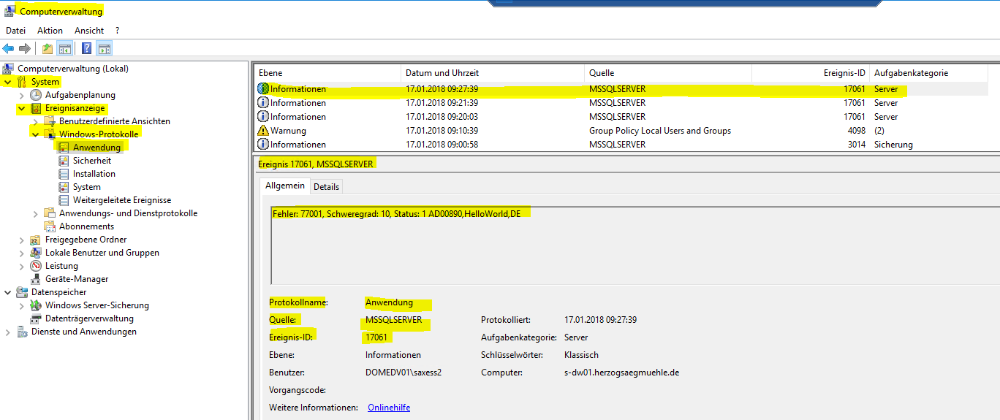
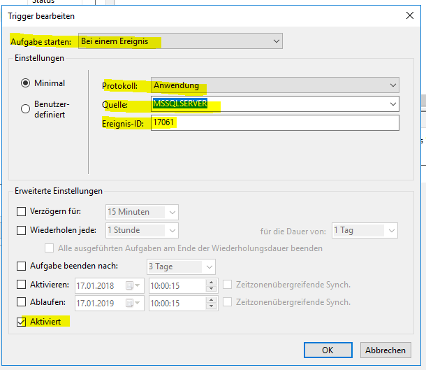
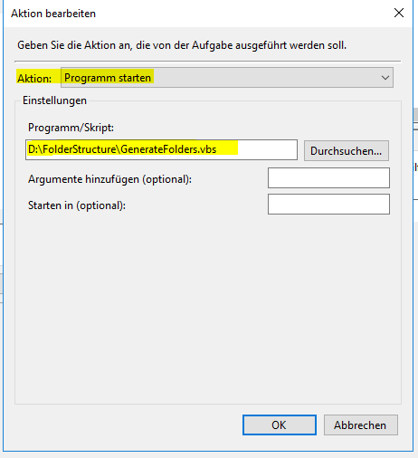

### Trigger task scheduler event via SQL stored procedure

- uses system extended stored procedure 'xp_logevent'  --> xp_logevent { error_number , 'message' } [ , 'severity' ] 
- membership in database role db_owner in master database or membership in server role sysadmin required
- writes message in SQL Server log file and Windows event viewer  
- execution of scheduled task is triggered on event
- event = specific event-id, source and log 

#### SQL stored procedure for writing into Windows log file
```SQL
USE PlanningFactory_META
DECLARE @Logstring NVARCHAR(1000);
DECLARE @ProductID NVARCHAR (255) = 'AD00890'
DECLARE @Language NVARCHAR (255) = 'DE'
DECLARE @Title NVARCHAR (255) = 'HelloWorld'

		SET @Logstring = @ProductID +',' + @Title + ',' + @Language 
		-- This will write an Entry to the SQL Server Eventlog (Name = Name of Instance), where a scheduled task is waiting for this event
		EXEC xp_logevent 77001,@Logstring,INFORMATIONAL
```
- **relevant information**
  - log: application
  - source: MSSQLServer
  - eventID: 17061
- results in 


#### Task in Windows task scheduler
**Trigger**  



**Action**  


