# Installation of the DataFactory WebComponents

## Preparations

### Add Roles and Features to you Win 2012 R2 Server

Start the Servermanager and edit Roles and Features  

Add Windows Auth to IIS  

Add ISAPI and ASP.NET 4.5  
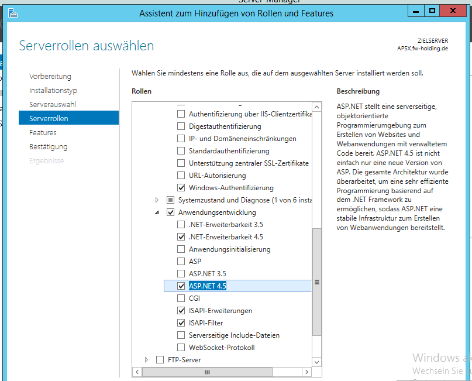

### Create a DOMAIN User "Domain\FactoryService" - a Standard User, NO Admin Rights anywhere
(at the screenshot the domain is missing, we learnt it a bit later the hard way..)
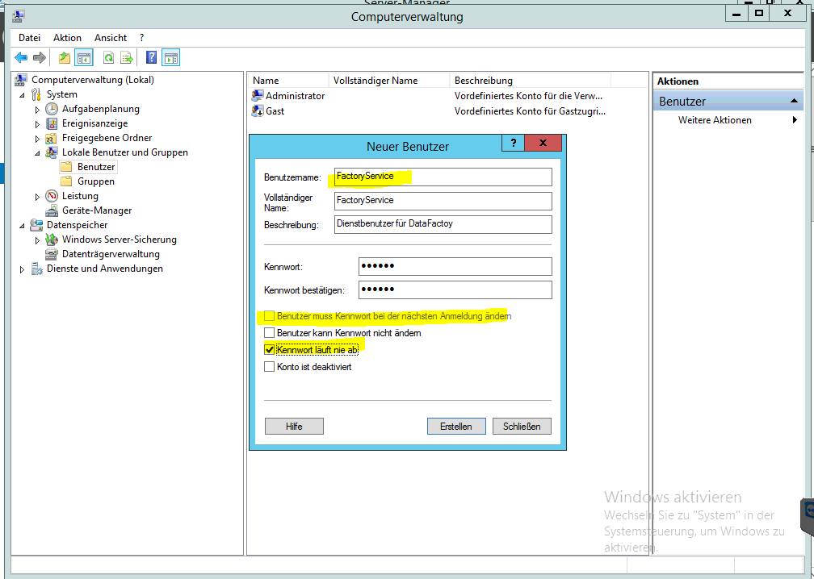

Add this user to SQL Server  

Keep only public rights on server level  

Give role pf_PlanningFactoryService in the DataFactory Database  

## Do Configuration of IIS Server

Start IIS Manager  

Enter Authentication of Default Website  
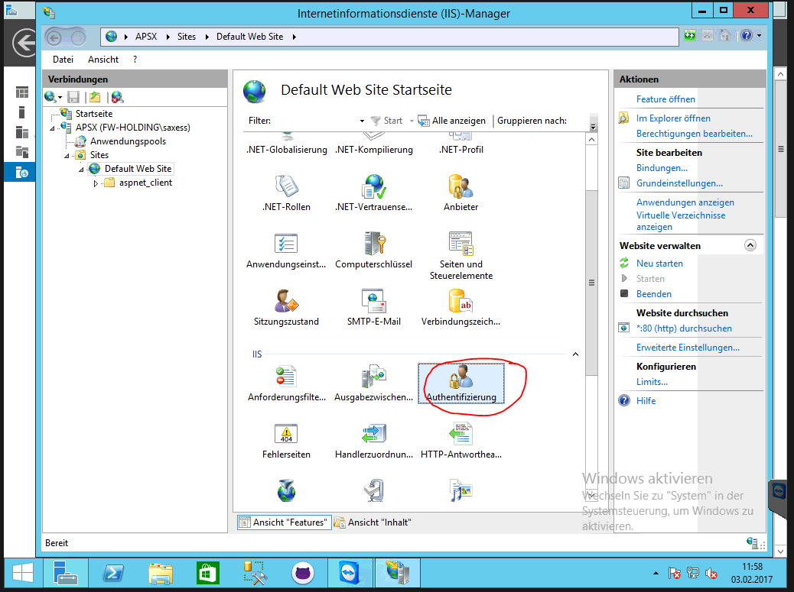

Activate Windows Auth  

Deactivate Anonymous Auth  
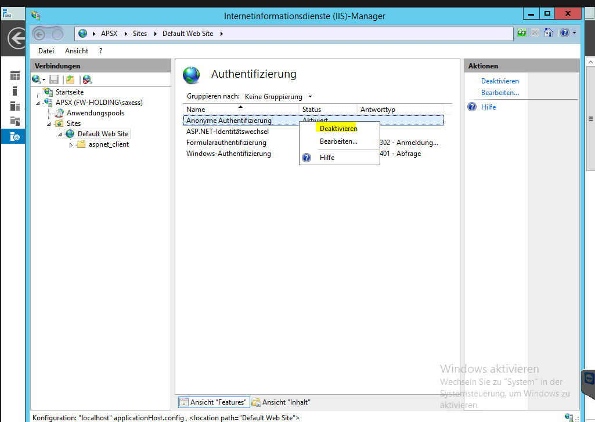

Delete default Website content  
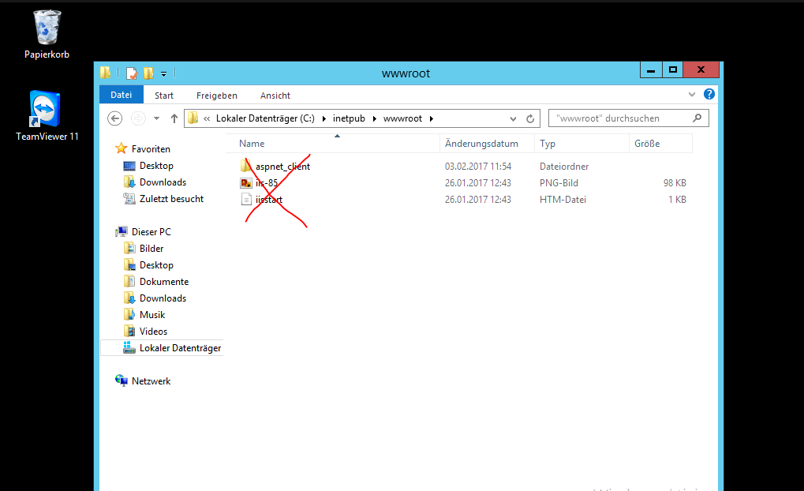

Unzip the DataFactory Application here  

Without Subdirectory on unzip  

Delete zip file after that, to have this directory structure  

Copy config.ini.example and rename to Config.ini  

Open config.ini from a Admin Notepad  

Delete SQL based connection string and use Windows Auth  

Do configuration of connection string to the DataFactory Database  
WindowsAuth = true/false means here if the Users will be identified by Windows or sxIDServer.
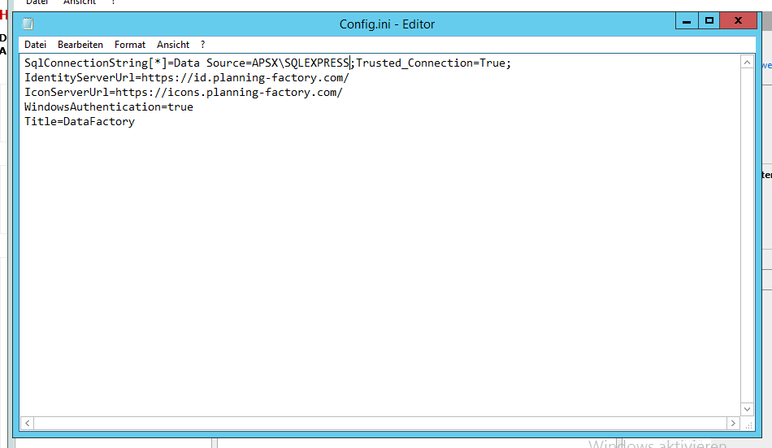

Set Identity of Application Pool to FactoryService   
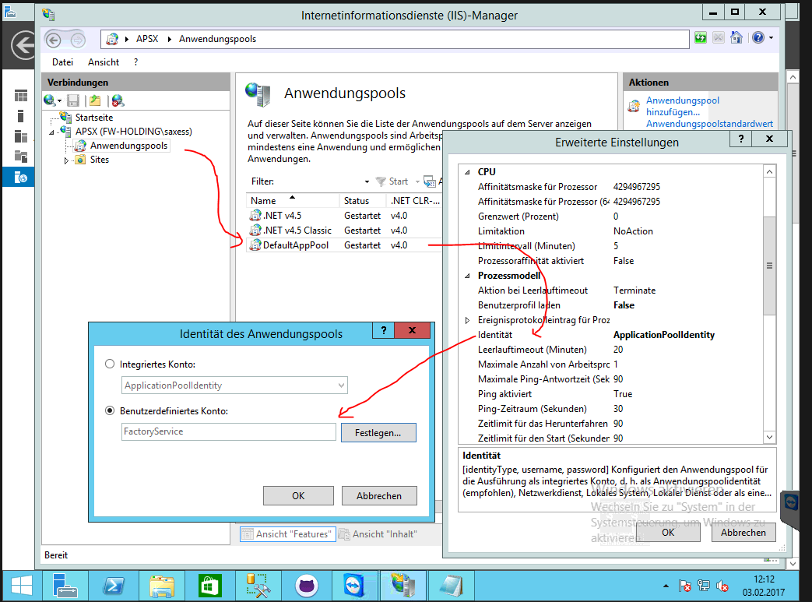

Set Timeout   
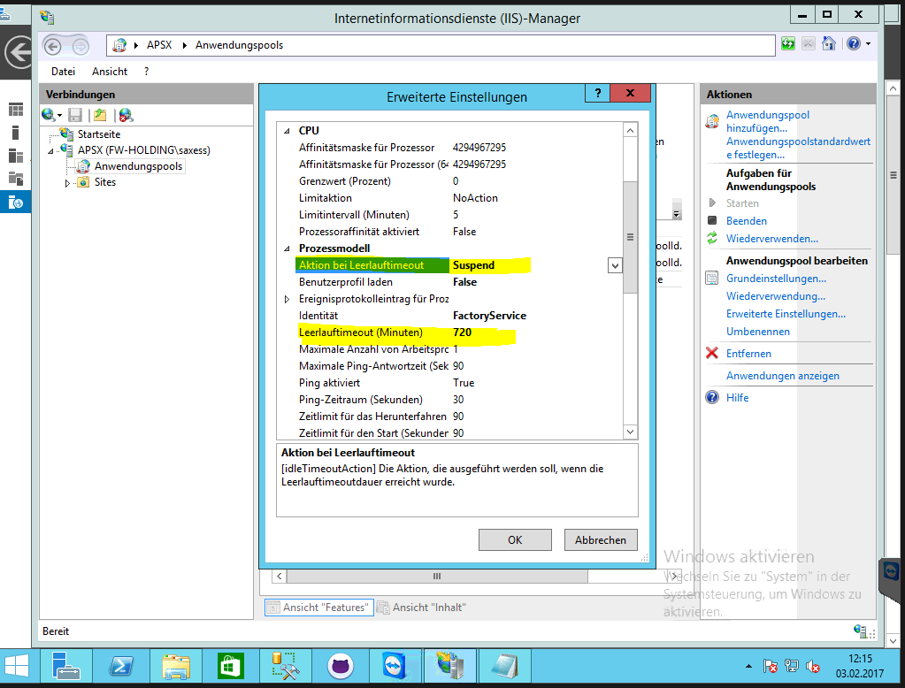

Set Always running  

Check the bindings - don't use a hard coded IP
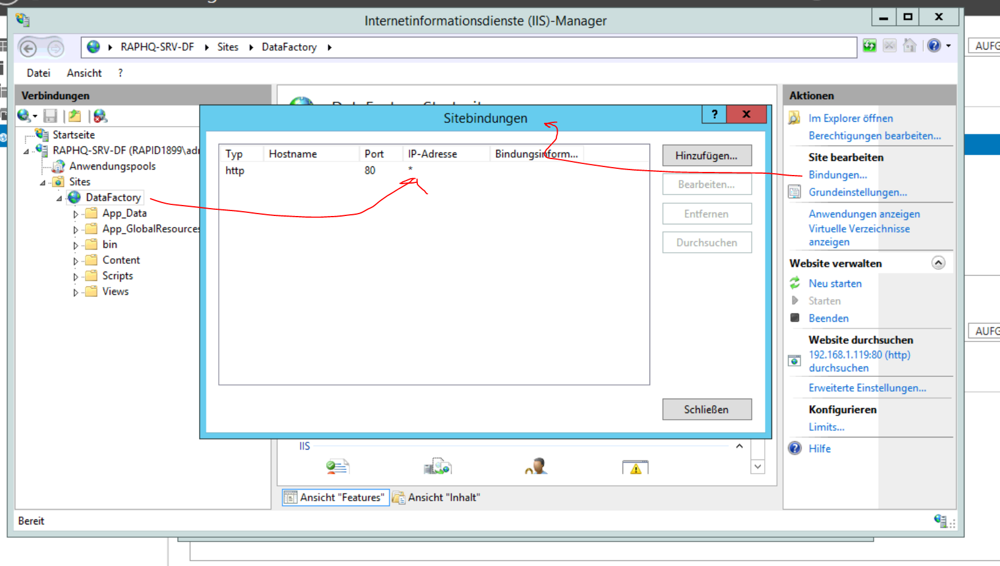

Restart Webserver (not only site) - as Site is "AlwaysRunning"

You should see this in any browser on localhost  
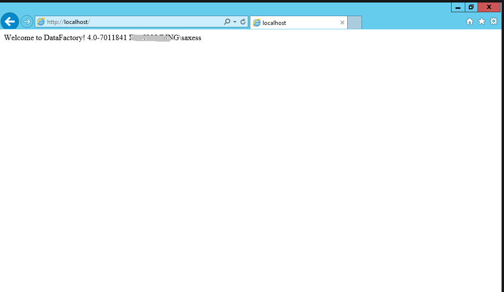

You should see your Factory on localhost/[DataBaseName]  

Give AppData Write Rights to FactoryService  
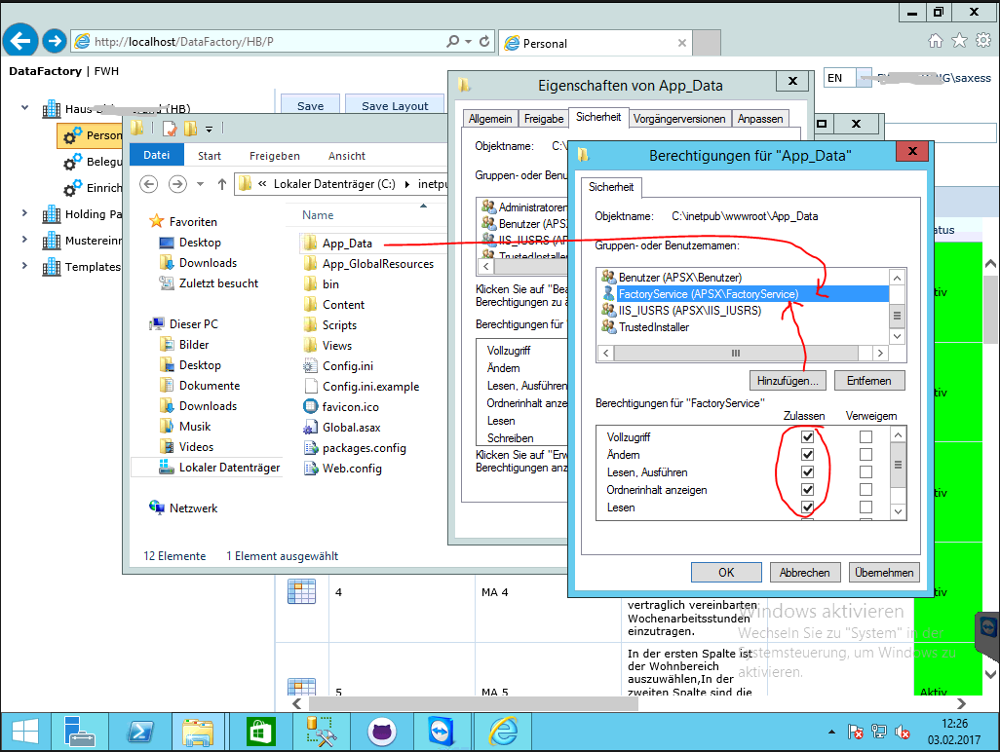

Tell the users the URL http://[Servername].Domain\[DataBaseName]  This should be FQDN e.g. http://web1.sx.intern/DataFactory

### Optional https Configuration

* Create a Certificate Request in the IIS Manager on TopLevel - Server Certificates
* this usually creates a .cer file (public) key
* Get a Certificate anyway, maybe free of charge from https://letsencrypt.org/
* You get back a certificate file, probablly a *.p7b file
* in IIS click on "Complete certificate request" and choose this file, after changing settings on *.*
* go the the site in ISS manager and set bindings for protocoll HTTPS with PORT 443
* Install URL Rewrite Modul of Windows Server to rewrite http requests with https

Other sources for Help
https://www.tbs-certificates.co.uk/FAQ/en/448.html

Other things to think on:  
* Maybe you must add this URL to the trusted Website for Internet Explorer
* Firefox don't support WindowsAuth in default - there is always a Pop-Up for credentials
* IE and Edge support WindowsAuth with Single SignOn

Enjoy for 5 minutes - and go on.
