# Installation of the DataFactory WebComponents

## Preparations

### Add Roles and Features to you Win 2012 R2 Server

Start the Servermanager and edit Roles and Features  
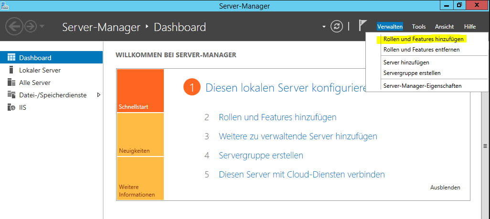

Add Windows Auth to IIS  
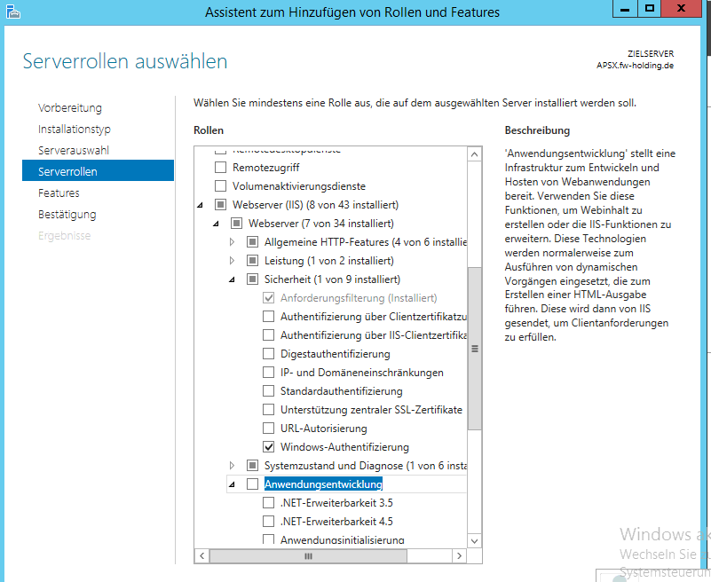

Add ISAPI and ASP.NET 4.5  

### Create a Windows User "FactoryService" - a Standard User, NO Admin Rights

Add this user to SQL Server  

Keep only public rights on server level  

Give role pf_PlanningFactoryService in the DataFactory Database  
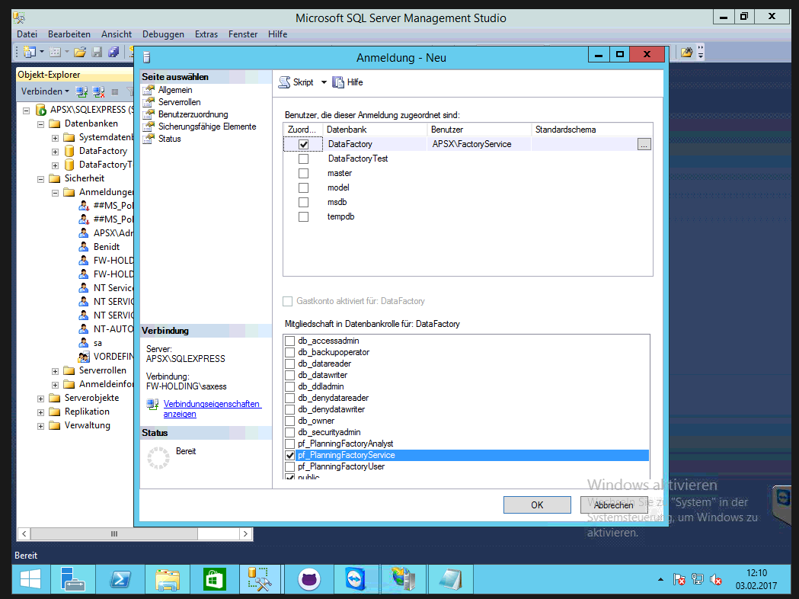

## Do Configuration of IIS Server

Start IIS Manager  
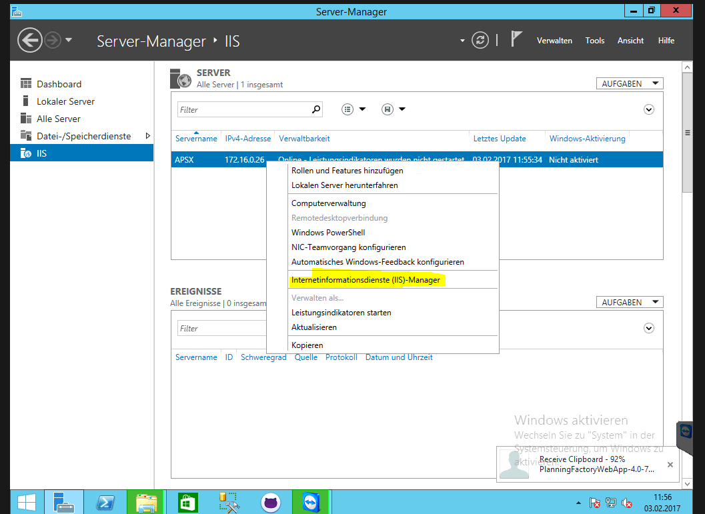

Enter Authentication of Default Website  

Activate Windows Auth  
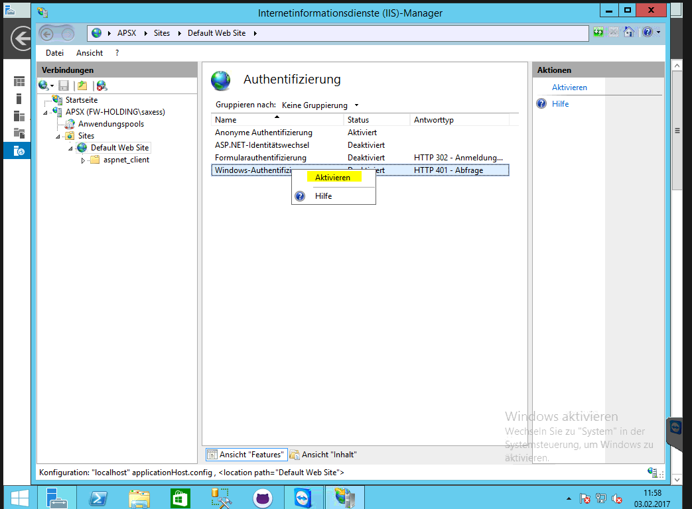

Deactivate Anonymous Auth  

Delete default Website content  

Unzip the DataFactory Application here  

Without Subdirectory on unzip  
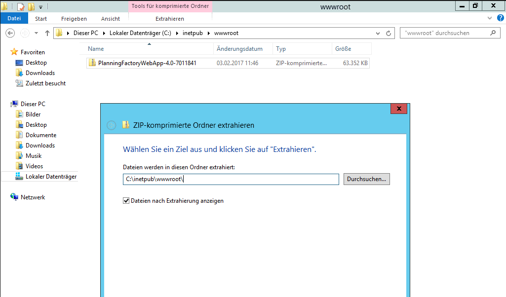

Delete zip file after that, to have this directory structure  
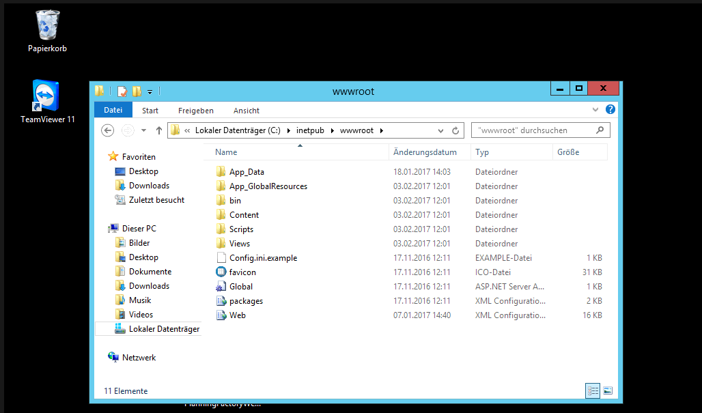

Copy config.ini.example and rename to Config.ini  
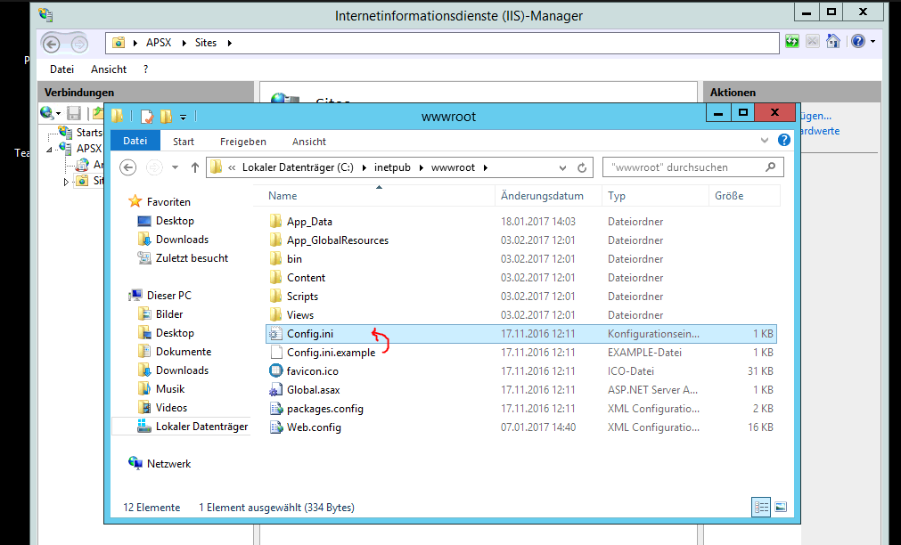

Open config.ini from a Admin Notepad  

Delete SQL based connection string and use Windows Auth  

Do configuration of connection string to the DataFactory Database    

Set Identity of Application Pool to FactoryService   

Set Timeout   

Set Always running  
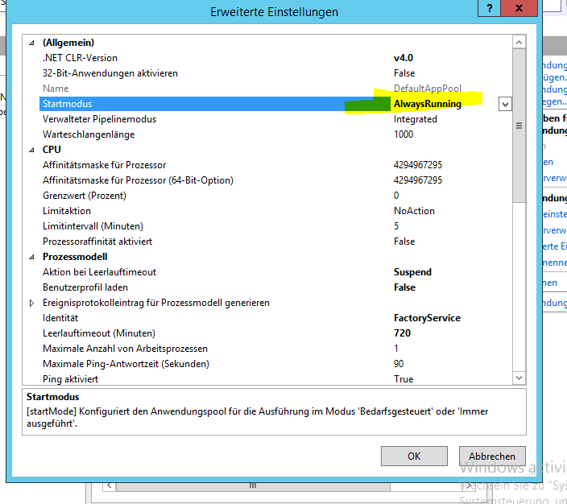

Restart Website  
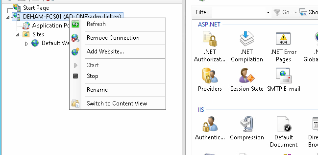

You should see this in any browser on localhost  

You should see your Factory on localhost/[DataBaseName]  
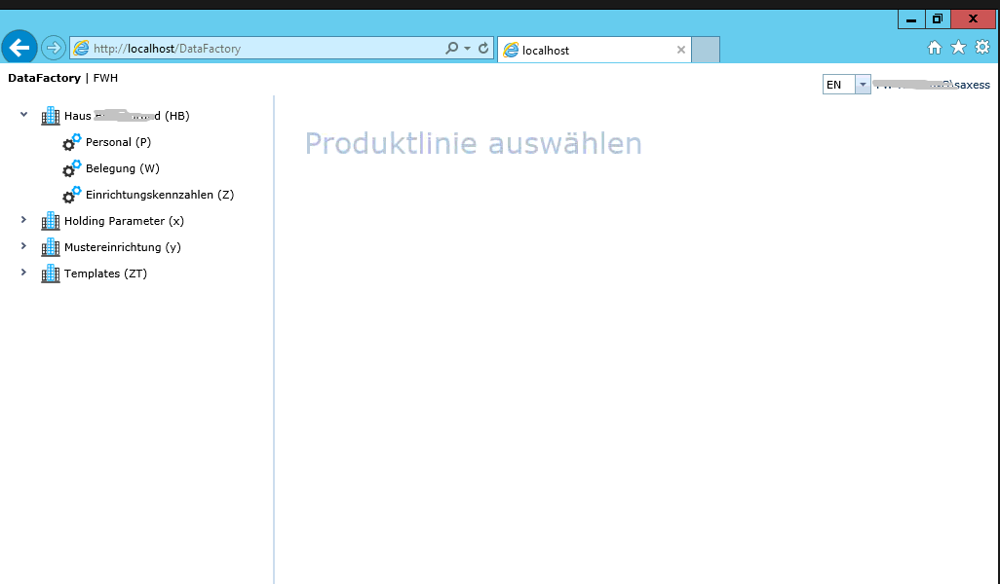

Give AppData Write Rights to FactoryService  

Tell the users the URL http://[Servername]\[DataBaseName]  

Enjoy for 5 minutes - and go on.